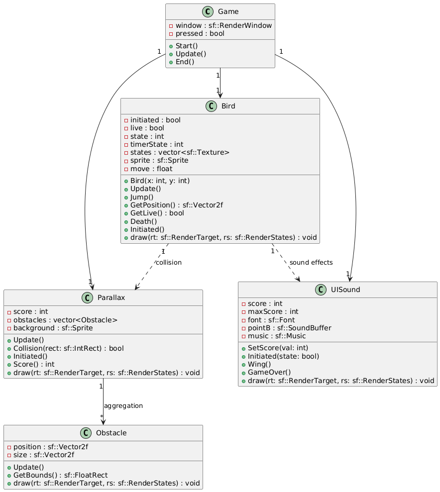

# FlappySquirrel

## Introduction

In the city of CetiGotham, where skyscrapers rose through the mist and danger lurked on every corner, a mysterious bat-squirrel appeared. No one knew her name or origin, but her bravery and determination stood out. The citizens, paralyzed by the menace of Mr Skunk and his corruption, waited for a savior to restore hope.
To reach Mr Skunk, the bat-squirrel had to face light amid the darkness—knowing that only her courage could save CetiGotham.

## Controls

To start the game, simply click the left mouse button and continue playing. To progress through obstacles, keep using the left mouse button.

## Compiling

Use 

- "make clean" to clear the cache
- "make" to compile all the files
- "./Game" to play

## Project Structure

The project is organized as follows:

- **bin**: Contains the binary files generated after compiling the code.
- **docs**: Stores the project documentation.
- **include**: Holds the header files (.hpp) for each class in the project.
- **src**: Contains the source files (.cpp) of the project.
- **Makefile**: Makefile used to compile and run the project.

## Class Diagram

The class diagram for the project includes the following classes:

- **Bird**: Represents the bird in the game.
- **Obstacle**: Represents the pipes the bird must avoid.
- **Game**: Manages the game logic.
- **Parallax**: Effect of obstacle movement.
- **UISounds**: Sound effects, and score display.

## Gameplay

### Menu Screen

### Gameplay

### Death Screen

